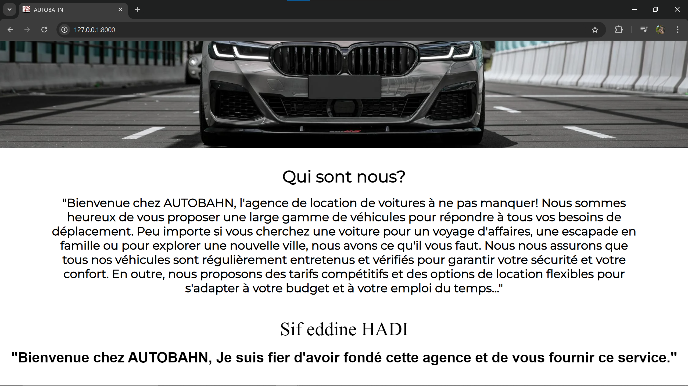
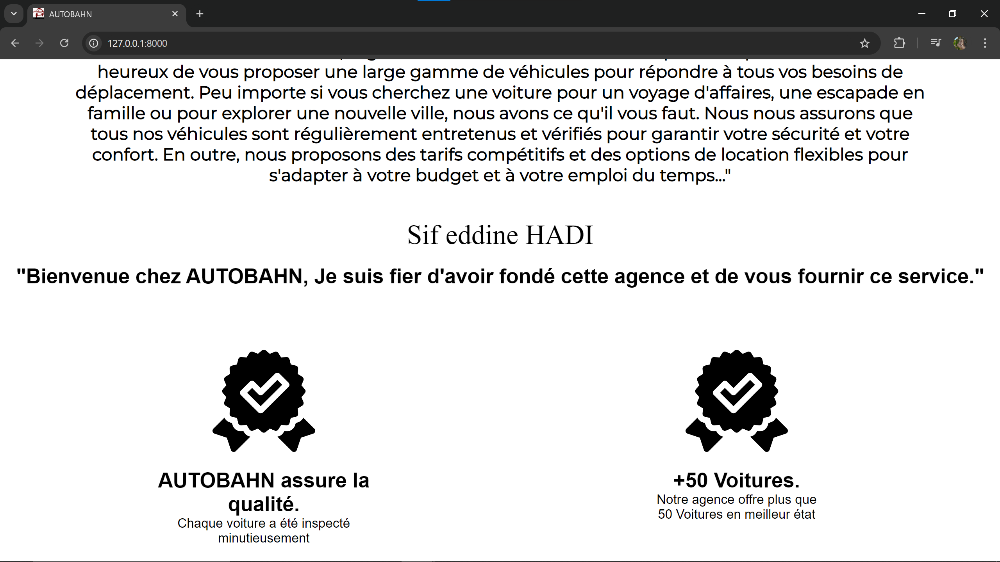

# Plateforme de Gestion de Location de Voitures
Cette application web est développée en utilisant le framework Laravel et permet de gérer la location de voitures pour une agence spécifique.

## Fonctionnalités
- Gestion des voitures (ajout, modification, suppression)
- Gestion des clients (ajout, modification, suppression)
- Gestion des locations (réservation, retour, facturation)
- Authentification des utilisateurs (administrateurs, agences, clients)
- Système de notifications (email, etc.)

## Configuration requise
- PHP 8.0 ou supérieur
- Composer
- Base de données (MySQL)
- Serveur web (Apache, Nginx, etc.)

## Installation
1. Clonez le dépôt Git :
   git clone https://github.com/votre-utilisateur/location-voitures.git

2. Accédez au répertoire du projet :
   cd autobahn-pfe

3. Installez les dépendances avec Composer :
   composer install

4. Copiez le fichier '.env.example' vers '.env' et configurez les paramètres de connexion à la base de données :
   cp .env.example .env

5. Générez la clé d'application Laravel :
   php artisan key:generate

6. Exécutez les migrations pour créer les tables de la base de données :
   php artisan migrate

7. Démarrez le serveur de développement :
   php artisan serve

8. Accédez à l'application dans votre navigateur à l'adresse 'http://localhost:8000'.

## Quelques captures d'écran

1. ## Espace visiteur

Page Nos voitures

Page Contactez-nous

Page Connexion

Page Inscription

2. ## Espace administrateur

